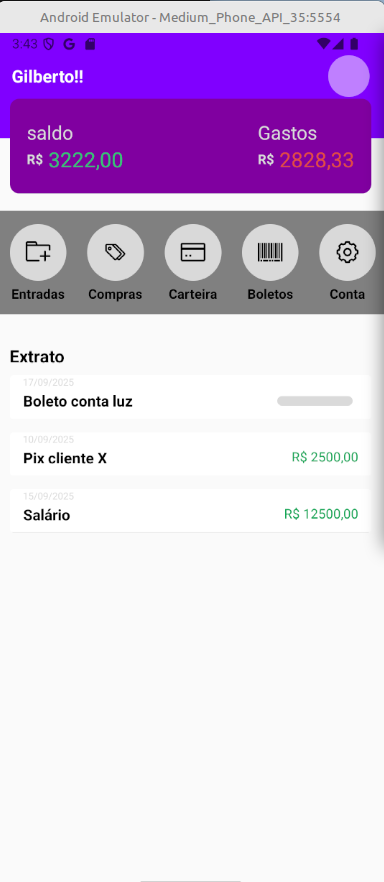

# OBJETIVO:  demonstrar componentes do react-native e usar a biblioteca moti

https://moti.fyi/

Para criar projeto: 

npx create-expo-app financa --template

Para executar o projeto: 

npx expo start -c --go

## SUJEITO PROGRAMADOR: 

Criando app finanças passo á passo com React Native

https://www.youtube.com/watch?v=REulDg3JzzQ


Vamos criar uma aplicação simples que mostra o Saldo Gastos e alguns itens. 


[](assets/docs/telafinal.png)

#### Estrutura final do seu projeto:
```
projeto/
├── src/
│   ├── app/                    ← Pasta do Expo Router dentro de src
│   │   ├── _layout.tsx         ← CRIAR (obrigatório para Expo Router)
│   │   ├── index.tsx           ← Página inicial (já existe)
│   │   └── (outras-rotas)/     ← Outras páginas futuras
│   │
│   ├── components/             ← Componentes reutilizáveis
│   │   ├── Button/
│   │   ├── Header/
│   │   └── Footer/
│   │
│   ├── pages/                  ← Páginas específicas (se não usar app router)
│   │   └── Home.tsx
│   │
│   ├── hooks/                  ← Custom hooks
│   │   ├── useAuth.ts
│   │   └── useApi.ts
│   │
│   │
│   └── assets/                 ← Imagens, ícones, fonts
│       ├── images/
│       ├── icons/
│       └── fonts/
```

## ICONES:

https://icons.expo.fyi/Index

npm install @expo/vector-icons

import { Feather } from '@expo/vector-icons'

<Feather name="user" size={27} color="#000"/>


### extensão vscode 

Instala sujeito programador  e digite na área de texto : 

rnfunc 

```
expo --version
6.3.12

expo --version
v22.14.0

```
